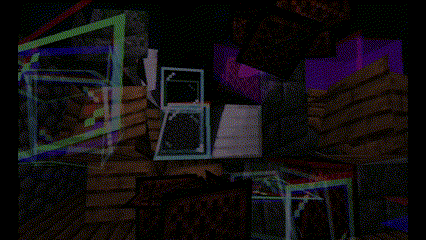
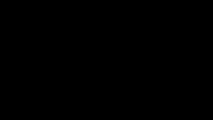

# 🎮 **OpenGL Project: Deux Salles, Deux Ambiances**  

**IGM – Master COmputer Graphics – 2024/2025**  
**Project Supervisor:** Venceslas Biri ([venceslas.biri@univ-eiffel.fr](mailto:venceslas.biri@univ-eiffel.fr))  

## 📚 **Project Overview**  
This project aims to develop a real-time 3D application using OpenGL, showcasing two visually distinct rooms resembling a virtual museum. The user can navigate smoothly between these rooms, each with unique illumination models, object modeling, and interactive elements.  

📖 You can check my notes on the project [here](note.md).

🤝 You can also check the credits for the project [here](credit.md).

---

## 🛠️ **Technical Specifications**  
- **Language:** C++  
- **Graphics API:** OpenGL 3+ (with shaders, no fixed pipeline)  
- **Platform:** Linux-compatible (g++ compiler) (developed on MacOS) 
- **Memory Management:** Not tested with Valgrind 
- **Libraries Used:** GL, SDL, glimac, GLew, glad, GLFW  
- **Version Control:** Git

---

## 🌟 **Introduction**

The project presents two distinct 3D environments, each representing a room governed by contrasting physical properties of light. These environments are designed to explore and visually demonstrate how altering a single fundamental property—whether light possesses mass or not—can significantly impact the environment's overall appearance and feel. 

The first room is a realistic representation of massless light, where light sources do not possess mass and do not affect the environment in any way other than illuminating it. To showcase this fact, I implemented the solar system as it is in real life, with the planets revolving around the sun at their respective speeds. 

The second room is a representation of light with mass, where light sources possess mass and as such, to keep their speed constant, they need infinite amounts of energy, thus creating black holes at their source. This brings up the gravitational pull effect, where the light sources warp the environment around them, creating a unique visual effect.

Representing two completely opposed physical properties of light in these 2 rooms, I think we have fittingly made "Deux Salles, Deux Ambiances".

The project is built in a Minecraft-like environment, which made it easier to get spec and normal maps for most of textures I used, and hopefully, a bit more original than just doing a plain solar system.

---

## 🎨 **Scene Description**  

- **Two Rooms:** 

    Each with unique characteristics.  
- **Skybox:** 
     - The skybox texture is randomly picked at launch time, using time as a seed, from a list of 4 textures.
     - The skyboxes have a space theme, to go with the rest of the project.
- **Room 1:** 
    - Shaders:
        - Room 1 supports textures, blinn phong, diffuse, specular maps, transparency, normal maps, dynamci light colros and intensities, along with a cube depth map to create dynamic shadows. Nothing specific happens in the vertex shader.
        - The goal of this shader is to create realistic conditions for the minecraft context of the project, with a realistic light model and shadows.
    - Scene:
        - The room is a representation of the solar system, with the sun in the middle, and the planets revolving around it. The planets are at a real life scale between each other, and the revolution speed of each planet is correct relative to Earth's speed. (Urans and Neptune's speeds were scaled up by 10)
        - For better viewing purposes, and to stick with the museum concept, I displayed each planet within glass cases at the ground level. Venus, Earth both have their atmospehres spinnign at differente rates, and saturn has its rings as well. The sun is coded as a transparent object with a shadow enabled light source in the middle, and is rendered with flat painting to avoid light artefacts, and look like a light source.

- **Room 2:** 
    - Shaders:
        - Room 2 presents a similar light model in the fact that it also supports blinn phong, diffuse, specular maps, transparency, normal maps, and shadows. But the difference and originality resides in the fact that light sources in this room have a gravitational pull, akin to that of a black hole. We used the vertex shader to physically pull the vertices of the objects towards the light source, creating an original effect off of the light source.
        - The frag shader also has a post processing effect that aims at recreating the old TVs effect, where subpixels are so big that the viewer can start to see the RGB separation. This effect is quite visible when the viewer is close to the screen, and gives a retro, almost glitchy feel to the room, which goes well with the gravitational pull effect.
    - Scene:
        - A Minecraft portal is built at the center of the room, with a light source in front of it, giving a the portal a otherworldly feel. To its left and right are several blocks to showcase the light model's capabilities, as they use normal and specular maps, and all have hand assigned shininess levels, and specular highlight colors. The blocks are also affected by the gravitational pull of the light source, and are warped accordingly.
        - The objects to the left and right are also here to display the room's shader model, and act as the mudeum's display pieces.
        The left object is a transparent white sphere, which is necessary to fully showcase the capabilities of the room 2 shader model, as the white in RGB is 1,1,1, and thus the sphere is perfectly affected by the light source's gravitational pull, which warps colors differently, because of the color spectrum's different wave lengths, and can display the distortion the best in this room.
- **Animated Object:** 
     - The Animated object that can be paused and resumed using `T` is the Rocking Chair, displayed on the right hand side of Room 1, for a great viewing angle of the solar system.
     - Though the solar system is also animated, it is not pausable.
     - The planets are at a real life scale between each other, and the revolution speed of each planet is correct relative to Earth's speed. (Urans and Neptune's speeds were scaled up by 10)
     - The second room also has animated visuals, the nether portal animation is based on light intensity, and the stronger the light source, the more pull it has on the portal, and the more it warps the portal's texture. There are 2 lights, revolving around a white sphere, and a torus.

---

## 🕹️ **User Controls**  

- **Navigation:** FPS-style movement (fixed height) `ZQSD`
- **Toggle Wireframe Mode:** Press `Y`  
- **Start/Stop Animation:** Press `T`  
- **Toggle Light in Room 1:** Press `R`  
- **Exit Application:** Press `Escape`  

---

## 💻 **Installation & Compilation** 

**THE FINAL VERSION IS IN THE BRANCH `optimization`**

```bash
git clone https://github.com/RyuKaSa/GL_UGE_Project.git
cd GL_UGE_Project
git fetch --all
git checkout optimization
mkdir bin
cd bin
cmake ..
make
./APP3_executable
```

## 📸 **Gallery**

In this part, I will add some screenshots and GIFs of the project, to give a better idea of what it looks like. Some of the screenshots showcase the end result of the rooms, and some others showcase the capabilities of the shaders, and the effects they can produce.

### Scenes

#### Room 1:


The following shows the Earth, with its atmosphere whichs spins at a different rate than the planet itself.


The following shows Saturn, with its rings.


This is an eclipse (camera POV) of the sun, with Mercury in front of it.


#### Room 2:

We can see the red, green and blue separation on the white sphere, and the warp effect on the blocks.




The nether portal has a slight movign animation, and the portal itself seems to shine, as if emitting light.


From this part of the universe, we can see that the sun is akin to a black hole.


The wireframe mode clearly highlights the RGB depenency of the distortion, as well as the subpixel effect.


### Features



We can see the specular reflection on the different blocks, and the iron block lets us see the normal map coupled with high reflectiveness in action.
The emerald shards in the deepslate ore block are also visible, and transmit a slightly greenish reflection.
We can see the cood based blocks have a significantly lower shininess, and the specular highlight is less visible, which is realistic.


We can see the shadows in action here, using a cube depth map, and the shadows are dynamic, and change with the light source's position.
Disabling the main light source (the sun) using R, disables the shadows as well.


We can see the vertex shader in action, with no post processing effect, and the RGB distortion is very strong, enforcing the wavelength dependent gravitational pull effect.


Transparent objects can be tinted, and be affected by normal maps, and specular highlights.
(not visible on this image, but the transparent faces pull the color around them, not just their normals, which lets the transparent object simulate refraction, to a certain extent)


The skybox is randomly picked at launch time, from a pool of 4 space themed spheremaps, using time as a seed.


RyuKaSa © 2025